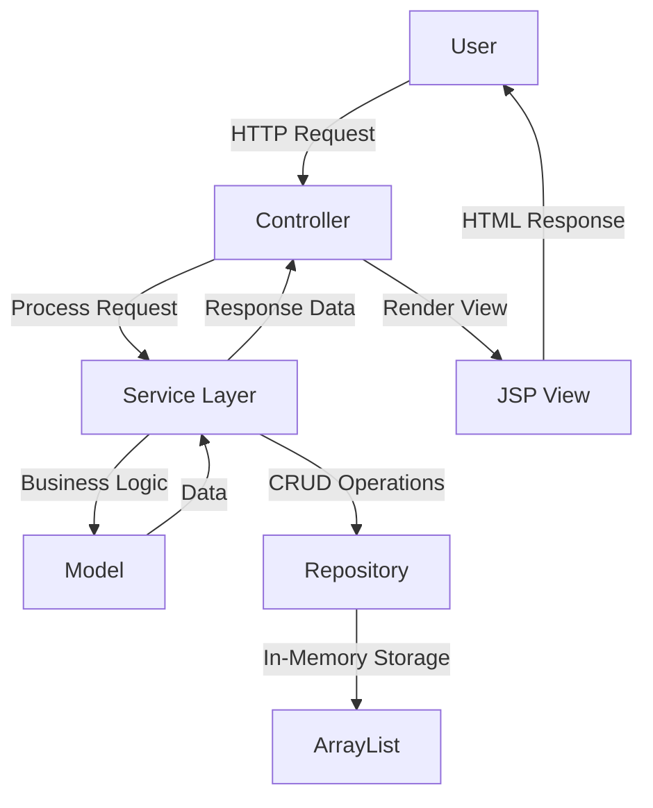

# 🛠️ Tools.com - Multi-Purpose Utility Tools Web Application

<div align="center">


[](https://spring.io/projects/spring-boot)
[](https://openjdk.org/)
[](https://tailwindcss.com/)
[](https://jakarta.ee/specifications/pages/)
[](LICENSE)

**A modern, beautifully designed web application providing essential utility tools for everyday calculations and conversions.**

[Features](#-features) • [Installation](#-installation) • [Usage](#-usage) • [Architecture](#-architecture) • [Contributing](#-contributing)

</div>

---

## 📋 Table of Contents

- [Overview](#-overview)
- [Features](#-features)
- [Technology Stack](#-technology-stack)
- [Installation](#-installation)
- [Usage](#-usage)
- [Architecture](#-architecture)
- [Database Schema](#-database-schema)
- [Project Structure](#-project-structure)
- [API Documentation](#-api-documentation)
- [Screenshots](#-screenshots)
- [Contributing](#-contributing)
- [License](#-license)
- [Contact](#-contact)

---

## 🌟 Overview

**Tools.com** is a comprehensive web-based utility application built with Spring Boot and modern web technologies. It provides users with a suite of essential calculation and conversion tools through an elegant, responsive interface.

### Key Highlights

- 🎨 **Modern UI/UX** - Beautiful gradient designs with smooth animations
- 📱 **Fully Responsive** - Works seamlessly across all devices
- ⚡ **Fast & Lightweight** - Optimized performance with Spring Boot
- 🔧 **Multiple Tools** - Six different utility calculators in one place
- 💾 **History Tracking** - Track your calculation history (Calculator feature)

---

## ✨ Features

### 1. 🧮 Calculator
- Basic arithmetic operations (+, -, ×, ÷, %)
- Real-time calculation results
- **History Panel** - View all previous calculations
- Clear history functionality
- Error handling for division by zero

### 2. 🔄 Unit Converter
- **Length Conversion** - meters, feet, inches, etc.
- **Weight Conversion** - kg, pounds, grams, etc.
- **Temperature Conversion** - Celsius, Fahrenheit, Kelvin
- **Currency Conversion** - Multiple currency support

### 3. 📊 BMI Calculator
- Calculate Body Mass Index
- Height input (cm)
- Weight input (kg)
- BMI category classification

### 4. 💰 Loan/EMI Calculator
- Calculate monthly EMI payments
- Interest rate calculations
- Loan tenure planning
- Total payment breakdown

### 5. 🎂 Age Calculator
- Calculate exact age from birthdate
- Years, months, and days breakdown
- Date picker interface

### 6. 📝 Text Utilities
- Convert text to **UPPERCASE**
- Convert text to **lowercase**
- Character and word counting
- Text clearing functionality

---

## 🔧 Technology Stack

### Backend
- **Framework**: Spring Boot 3.5.6
- **Language**: Java 21
- **Build Tool**: Maven
- **View Technology**: JSP with JSTL
- **Server**: Apache Tomcat (Embedded)

### Frontend
- **CSS Framework**: Tailwind CSS 4.1.13
- **Styling**: Custom animations and gradients
- **Responsive Design**: Mobile-first approach
- **Icons**: Custom gradient-based designs

### Development Tools
- **Lombok**: Reduce boilerplate code
- **Spring DevTools**: Hot reload during development
- **Maven Compiler**: Java 21 support

---

## 📥 Installation

### Prerequisites

Before you begin, ensure you have the following installed:

- ☕ **Java 21** or higher
- 📦 **Maven 3.8+**
- 🌐 **Node.js & npm** (for Tailwind CSS)
- 💻 **IDE** (IntelliJ IDEA, Eclipse, or VS Code)

### Step-by-Step Setup

1. **Clone the Repository**
   ```bash
   git clone https://github.com/yourusername/tools.com.git
   cd tools.com
   ```

2. **Install Node Dependencies**
   ```bash
   npm install
   ```

3. **Build Tailwind CSS**
   ```bash
   npx @tailwindcss/cli@latest -i ./input.css -o ./src/main/resources/static/css/output.css
   ```

4. **Build the Project**
   ```bash
   mvn clean install
   ```

5. **Run the Application**
   ```bash
   mvn spring-boot:run
   ```

6. **Access the Application**
   ```
   Open your browser and navigate to: http://localhost:9090
   ```

---

## 🚀 Usage

### Running in Development Mode

```bash
# With hot reload enabled
mvn spring-boot:run

# With custom port
mvn spring-boot:run -Dspring-boot.run.arguments=--server.port=8080
```

### Building for Production

```bash
# Create executable JAR
mvn clean package

# Run the JAR
java -jar target/tools-0.0.1-SNAPSHOT.jar
```

### Accessing Different Tools

| Tool | URL | Description |
|------|-----|-------------|
| Home | `http://localhost:9090/` | Main dashboard |
| Calculator | `http://localhost:9090/calculator` | Basic calculator with history |
| Unit Converter | `http://localhost:9090/converter` | Multi-unit converter |
| BMI Calculator | `http://localhost:9090/bmi` | Body Mass Index calculator |
| Loan Calculator | `http://localhost:9090/loan` | EMI and loan calculator |
| Age Calculator | `http://localhost:9090/age` | Age from birthdate |
| Text Utilities | `http://localhost:9090/texttools` | Text transformation tools |

---

## 🏗️ Architecture

### MVC Pattern Implementation

```
┌─────────────────────────────────────────────────────────┐
│                      Client Browser                      │
│              (JSP Views with Tailwind CSS)              │
└────────────────────────┬────────────────────────────────┘
                         │
                         │ HTTP Request
                         ▼
┌─────────────────────────────────────────────────────────┐
│                    Controllers Layer                     │
│  ┌──────────────┐  ┌──────────────┐  ┌──────────────┐  │
│  │ HomeController│  │ Calculator   │  │ BMIController│  │
│  │              │  │ Controller   │  │              │  │
│  └──────────────┘  └──────────────┘  └──────────────┘  │
└────────────────────────┬────────────────────────────────┘
                         │
                         │ Business Logic
                         ▼
┌─────────────────────────────────────────────────────────┐
│                    Services Layer                        │
│  ┌──────────────┐  ┌──────────────┐  ┌──────────────┐  │
│  │ Calculator   │  │ Converter    │  │ BMI Service  │  │
│  │ Service      │  │ Service      │  │              │  │
│  └──────────────┘  └──────────────┘  └──────────────┘  │
└────────────────────────┬────────────────────────────────┘
                         │
                         │ Data Access
                         ▼
┌─────────────────────────────────────────────────────────┐
│                  Repository Layer                        │
│            ┌─────────────────────────────┐              │
│            │ historyOperationsRepo       │              │
│            │ (In-Memory Data Storage)    │              │
│            └─────────────────────────────┘              │
└─────────────────────────────────────────────────────────┘
```

### Component Interaction Flow



---

## 🗄️ Database Schema

### Current Implementation: In-Memory Storage

The application currently uses **in-memory storage** for the Calculator history feature. No persistent database is required.

#### Data Model

```java
public class calculatorModel {
    private int num1;           // First operand
    private int num2;           // Second operand
    private String operator;    // Operation symbol (+, -, *, /, %)
    private double result;      // Calculation result
}
```

#### Repository Structure

```java
@Repository
public class historyOperationsRepo {
    private List<calculatorModel> Operations = new ArrayList<>();
    
    // Methods:
    // - addOperation(calculatorModel Operation)
    // - clearAll()
    // - getAllOperation()
}
```

### Future Database Schema (Proposed)

For production deployment with persistent storage, here's the recommended schema:

#### Entity Relationship Diagram

```
┌─────────────────────────────────────────────┐
│            CALCULATION_HISTORY              │
├─────────────────────────────────────────────┤
│ PK │ id              BIGINT AUTO_INCREMENT  │
│    │ num1            INTEGER                │
│    │ num2            INTEGER                │
│    │ operator        VARCHAR(1)             │
│    │ result          DOUBLE                 │
│    │ created_at      TIMESTAMP              │
│ FK │ user_id         BIGINT (nullable)      │
└─────────────────────────────────────────────┘
         │
         │ Many-to-One
         ▼
┌─────────────────────────────────────────────┐
│                 USERS                        │
├─────────────────────────────────────────────┤
│ PK │ id              BIGINT AUTO_INCREMENT  │
│    │ username        VARCHAR(50) UNIQUE     │
│    │ email           VARCHAR(100) UNIQUE    │
│    │ created_at      TIMESTAMP              │
└─────────────────────────────────────────────┘
```

#### SQL Schema Definition

```sql
-- Users Table (Future Enhancement)
CREATE TABLE users (
    id BIGINT PRIMARY KEY AUTO_INCREMENT,
    username VARCHAR(50) NOT NULL UNIQUE,
    email VARCHAR(100) NOT NULL UNIQUE,
    created_at TIMESTAMP DEFAULT CURRENT_TIMESTAMP
);

-- Calculation History Table
CREATE TABLE calculation_history (
    id BIGINT PRIMARY KEY AUTO_INCREMENT,
    num1 INTEGER NOT NULL,
    num2 INTEGER NOT NULL,
    operator VARCHAR(1) NOT NULL,
    result DOUBLE NOT NULL,
    created_at TIMESTAMP DEFAULT CURRENT_TIMESTAMP,
    user_id BIGINT,
    FOREIGN KEY (user_id) REFERENCES users(id) ON DELETE CASCADE,
    INDEX idx_user_id (user_id),
    INDEX idx_created_at (created_at)
);

-- BMI Records Table (Future Enhancement)
CREATE TABLE bmi_records (
    id BIGINT PRIMARY KEY AUTO_INCREMENT,
    height_cm DECIMAL(5,2) NOT NULL,
    weight_kg DECIMAL(5,2) NOT NULL,
    bmi_value DECIMAL(5,2) NOT NULL,
    bmi_category VARCHAR(20),
    created_at TIMESTAMP DEFAULT CURRENT_TIMESTAMP,
    user_id BIGINT,
    FOREIGN KEY (user_id) REFERENCES users(id) ON DELETE CASCADE
);

-- Conversion History Table (Future Enhancement)
CREATE TABLE conversion_history (
    id BIGINT PRIMARY KEY AUTO_INCREMENT,
    conversion_type VARCHAR(20) NOT NULL,
    from_value DECIMAL(15,4) NOT NULL,
    from_unit VARCHAR(20) NOT NULL,
    to_value DECIMAL(15,4) NOT NULL,
    to_unit VARCHAR(20) NOT NULL,
    created_at TIMESTAMP DEFAULT CURRENT_TIMESTAMP,
    user_id BIGINT,
    FOREIGN KEY (user_id) REFERENCES users(id) ON DELETE CASCADE
);
```

---

## 📁 Project Structure

```
tools/
├── src/
│   ├── main/
│   │   ├── java/com/portfolio/tools/
│   │   │   ├── controller/           # MVC Controllers
│   │   │   │   ├── HomeController.java
│   │   │   │   ├── CalculatorController.java
│   │   │   │   ├── BMICalculatorController.java
│   │   │   │   ├── LoanCalculatorController.java
│   │   │   │   ├── AgeCalculatorController.java
│   │   │   │   ├── ConverterController.java
│   │   │   │   └── TextToolsController.java
│   │   │   │
│   │   │   ├── service/              # Business Logic
│   │   │   │   ├── CalculatorService.java
│   │   │   │   ├── BMIService.java
│   │   │   │   ├── LoanService.java
│   │   │   │   ├── AgeService.java
│   │   │   │   ├── ConverterService.java
│   │   │   │   └── TextService.java
│   │   │   │
│   │   │   ├── model/                # Data Models
│   │   │   │   └── calculatorModel.java
│   │   │   │
│   │   │   ├── repo/                 # Data Access Layer
│   │   │   │   └── historyOperationsRepo.java
│   │   │   │
│   │   │   └── ToolsApplication.java # Main Application
│   │   │
│   │   ├── resources/
│   │   │   ├── static/
│   │   │   │   └── css/
│   │   │   │       ├── output.css    # Compiled Tailwind CSS
│   │   │   │       └── style.css     # Custom styles
│   │   │   │
│   │   │   └── application.properties # App configuration
│   │   │
│   │   └── webapp/
│   │       └── views/                # JSP Views
│   │           ├── index.jsp         # Home page
│   │           ├── calculator.jsp    # Calculator tool
│   │           ├── bmi.jsp          # BMI calculator
│   │           ├── loan.jsp         # Loan calculator
│   │           ├── age.jsp          # Age calculator
│   │           ├── converter.jsp    # Unit converter
│   │           └── texttools.jsp    # Text utilities
│   │
│   └── test/                        # Unit tests
│
├── input.css                        # Tailwind input
├── package.json                     # Node dependencies
├── pom.xml                         # Maven configuration
└── README.md                       # This file
```

---

## 📡 API Documentation

### Calculator Endpoints

#### GET `/calculator`
**Description**: Display calculator page and clear history  
**Response**: Renders `calculator.jsp`

#### POST `/calculator`
**Description**: Perform calculation and store in history  
**Request Body**:
```json
{
  "num1": 10,
  "num2": 5,
  "operator": "+"
}
```
**Response**: Returns calculation result and history list

### Navigation Endpoints

| Method | Endpoint | Description |
|--------|----------|-------------|
| GET | `/` | Home page with tool cards |
| GET | `/calculator` | Calculator tool |
| GET | `/converter` | Unit converter |
| GET | `/bmi` | BMI calculator |
| GET | `/loan` | Loan/EMI calculator |
| GET | `/age` | Age calculator |
| GET | `/texttools` | Text utilities |

---

## 📸 Screenshots

### Home Page
```
┌─────────────────────────────────────────────────────────┐
│                     🛠️ Tools                            │
│            Multi-purpose utility tools web app           │
├─────────────────────────────────────────────────────────┤
│                                                          │
│  ┌──────────┐  ┌──────────┐  ┌──────────┐             │
│  │   Unit   │  │Calculator│  │   BMI    │             │
│  │Converter │  │          │  │Calculator│             │
│  └──────────┘  └──────────┘  └──────────┘             │
│                                                          │
│  ┌──────────┐  ┌──────────┐  ┌──────────┐             │
│  │   Loan   │  │   Age    │  │   Text   │             │
│  │Calculator│  │Calculator│  │Utilities │             │
│  └──────────┘  └──────────┘  └──────────┘             │
│                                                          │
└─────────────────────────────────────────────────────────┘
```

### Calculator with History
```
┌────────────────────┬────────────────────┐
│    Calculator      │      History       │
├────────────────────┼────────────────────┤
│  [  First Num  ]   │ 10 + 5 = 15       │
│  [ Second Num  ]   │ 20 - 8 = 12       │
│  [ Operation ▼ ]   │ 15 × 3 = 45       │
│                    │ 100 ÷ 4 = 25      │
│  Result: 0         │                    │
│                    │ [Clear History]    │
│  [ Calculate ]     │                    │
│  [ Back Home ]     │                    │
└────────────────────┴────────────────────┘
```

---

## 🤝 Contributing

We welcome contributions! Please follow these steps:

1. **Fork the Repository**
   ```bash
   git fork https://github.com/yourusername/tools.com.git
   ```

2. **Create a Feature Branch**
   ```bash
   git checkout -b feature/AmazingFeature
   ```

3. **Commit Your Changes**
   ```bash
   git commit -m 'Add some AmazingFeature'
   ```

4. **Push to Branch**
   ```bash
   git push origin feature/AmazingFeature
   ```

5. **Open a Pull Request**

### Code Style Guidelines
- Follow Java naming conventions
- Use Lombok annotations appropriately
- Write meaningful commit messages
- Add comments for complex logic
- Ensure all tests pass

</div>
